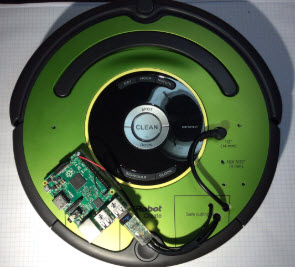

# iRobotCreate and Raspberry Pi



The iRobotCreate is a fantastic base platform for robotics clubs and classes. The Roomba is a familiar appliance in our society today. The 
Create is a genuine refurbished Roomba robot with a serial interface port. You can use a USB-to-serial dongle to control the
robot from your computer. Or mount a raspberry pi to the robot for a stand-alone mobile brain you connect to through wifi.

Have a look at my own robotics class here: https://github.com/topherCantrell/class-piCreate

Here is the official documentation, version 1 hardware (old):

http://www.irobot.com/filelibrary/pdfs/hrd/create/Create%20Open%20Interface_v2.pdf

Version 2 hardware (current):

http://www.irobotweb.com/~/media/MainSite/PDFs/About/STEM/Create/iRobot_Roomba_600_Open_Interface_Spec.pdf

## Build the Robot

[Follow this guide](HARDWARE.md) to get your robot hardware running. The guide shows how to connect a Raspberry Pi to the iCreate1 and iCreate2.
The guide includes wiring diagrams and links to buy the parts.

## Installation

On the Raspberry Pi:
```
git clone https://github.com/topherCantrell/robots-piCreate
cd robots-piCreate
sudo python3 setup.py install
```

## Web Control

This web server runs on the raspberry pi and controls the robot from a browser on a mobile device (phone or tablet). 
This is a great platform to take to out-reach events. Put your club flyers on the robot and drive it around the event. 
Invite kids to drive the robot, and talk to them about your club.

The web interface allows scripted control through drag-and-drop commands. Users can try their hand at rudimentary programming challenges.

Run the webserver controller:
```
cd webcontrol
python3 server.py
```

